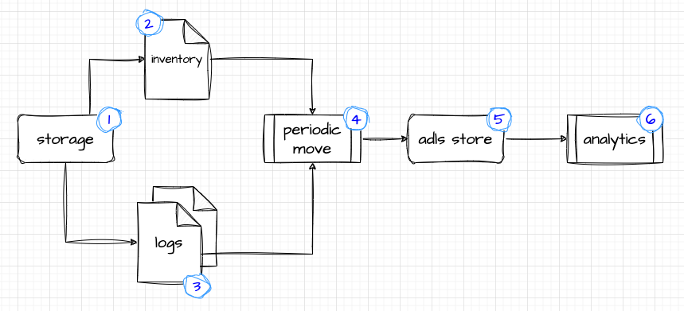

# BlobInsight

This repository aims to guide you through creating blob lifecycle policies rooted in real usage patterns. We've included an exploratory notebook as an example. This notebook offers fundamental steps and queries to help you grasp how your storage account is accessed. However, the notebook is given 'as is' and isn't meant for direct production use. Think of it as a starting point for deeper analysis or further exploration.

## Abstract

If you're an Azure customer with significant storage bills, implementing blob lifecycle policies can help manage costs. While our current policies can handle basic tasks, like deleting or moving a blob after a set number of days since its creation or last access, they don't always reflect real usage patterns. For instance, they don't factor in the size of the blob.

It's worth noting that those responsible for creating and overseeing (DevOps Team) lifecycle management policies might not be well-versed in access patterns. They need tools that make it easy to manage blobs and reduce storage costs.

Identifying these access patterns takes time. It's also crucial to grasp the storage cost model and its various tiers. For a comprehensive overview of the cost model, check out this [page](https://azure.microsoft.com/en-us/pricing/details/storage/blobs/#pricing).

### Cloud providers and storage

As context, lets look at the way cloud providers address the problem.

| Attribute | Google Cloud Storage | Amazon S3 | Azure Blob Storage |
|-----------|----------------------|-----------|--------------------|
| Size | No | Yes | No |
| Last Modified Date | Yes | Yes | Yes |
| Last Accessed Date | Yes (via Autoclass) | No | Yes (with last access time tracking enabled) |
| Object Age | Yes | Yes | Yes |
| Storage Class | Yes  | Yes | Yes |
| Object Prefix | Yes | Yes | Yes |
| Object Tags | No | Yes | Yes (via blob index tags) |
| Versioning | No | Yes | Yes |
| Automatic Transitioning | Yes - Autoclass | No | Yes - Blob life cycle Policies |

The [gcp Auto class]([Title](https://cloud.google.com/storage/docs/autoclass)) allows customers that are uncertain of the access patterns to leverage the auto-class, this will not work for all use cases.

The __key differentiator__ in my opinion is from [aws]([Title](https://docs.aws.amazon.com/AmazonS3/latest/userguide/intro-lifecycle-rules.html)) as it allows for rules based on size.

### Azure storage - Cost model

Storage costs are influenced by several factors: monthly data volume, the variety and frequency of operations, data transfer expenses, and the redundancy option you pick. Each tier—Hot, Cool, Cold, and Archive—has its own pricing for data volume, operations, transfers, and redundancy.

Let's say you've got 1TB of storage. You'd spend roughly:

- $20 in Hot
- $10 in Cool
- $4.5 in Cold
- A little over $2 in Archive

But remember, the total isn't just about storage size. It also factors in operations and any data transfers. So, just looking at storage savings when shifting between tiers isn't the whole picture. Deciding when to move data between tiers should be based on how often you access it. For instance, data retrieval is free in the Hot tier but comes at a [cost](https://azure.microsoft.com/en-us/pricing/details/storage/blobs/#pricing) in other tiers. The cost model also include penalties for moving data between tiers if performed within specific set of time periods.

## Data points

To figure out usage patterns, a single data point isn't enough. The [Blob Inventory](https://learn.microsoft.com/en-us/azure/storage/blobs/blob-inventory) gives us just a glimpse of the present situation. By itself, it doesn't tell us much about how things are being used. However, [diagnostic logs](https://learn.microsoft.com/en-us/azure/storage/common/manage-storage-analytics-logs?tabs=azure-portal) offer a detailed history of all interactions with storage accounts. These logs don't have the inventory's meta-data, therefore we need both: the inventory and the logs.

To keep costs down and because you can't merge inventory in log analytics, it's a good idea to archive to storage accounts using diagnostic settings. This way, we can store logs longer and still search through them when needed.

## Data collection

The following diagram illustrates the high level data flow for the inventory and the logs.



1. The storage that requires monitoring
2. Output of the blob inventory rules
3. Diagnostic logs (blob level)
4. A periodic process that would move both data points to a shared data lake
5. Existing or designated data lake
6. Analytic process that would join the two data points and produce the usage patterns

### Blob Inventory

Blob Inventory rules can be setup via the portal or using specific REST calls. This [document](https://learn.microsoft.com/en-us/azure/storage/blobs/blob-inventory) describe the multiple options to setup rules. In very high level you can create two types of periodic rules, daily or weekly, and you can capture the inventory as parquet or csv. For the later research steps it would advisable to use the parquet format. While you can leave the schema as is, it is also recommended to log only required meta-data. This will result in smaller files.

__Key points:__

- Pick and choose required schema elements only
- Weekly occurrences
- Parquet format
- Specific designated container

### Diagnostic logs

Diagnostic logs (classic) can be configured via the portal, for more information please visit this [document](https://learn.microsoft.com/en-us/azure/storage/common/manage-storage-analytics-logs?tabs=azure-portal). We recommend focusing on the Read operation on storage, as we do get update stamp and creation date from the inventory. Note that logs will accumulate, and as of now they cannot be stored directly to your hierarchal namespace.

### Data movement

Assuming the inventory is saved as parquet, the diagnostic logs, are saved as json lines, in an append_block blob type. This setup prevents us from directly accessing the content with Spark. So, we'll need to move the logs to an adls-gen2 account and while we do the move, we can also convert the json lines to parquet.

There are multiple options to do this:

- Using Azure Data Factory
- Azure Functions
- Python notebook

The sample implementation would use Azure Data Factory. Using a copy activity with ```json``` as _source_ and ```parquet``` as _sink_. Copy all logs from the storage account to the data lake. This example doesn't cover repeated analysis. If you need to do this regularly, consider automating the copying and deleting of logs from the original storage. Moving all data points to the same data lake will make it easier to query and analyze them.

## Tools

- Data Factory would be used to move both data points to the data lake.
- Azure databricks for all other data analytics. 

Data Factory was used as it provides no-code alternative and for the sake of one-time data movement it provide a simple solution. We selected Azure Databricks for its ease of operational and keeping your spark cluster to the minimum, as you can create a single node cluster for the purpose of these analytics.

## Taking your first steps

__1. Data Prep - Enabling logs and Blob Inventory:__ Enabling your diagnostic logs should be done as preliminary step, we need logs that span over a long period of time - the minimum is a month, however since some of the rules and policies span beyond 30 days, extending the logs to 3 or 6 months would provide better understanding of your blob's access patterns. The Blob Inventory setup can be once you have a month or so worth of logs.

__2. Data Movement:__ Use Azure Data Factory or other tool of your choice. It is assumed that both data points exist in the same data lake and as parquet files.

__3. Data Analytics:__ Create or reuse a Azure Databricks workspace. Getting started we suggest to start with a single node cluster. Import the notebook from this repository and follow the steps mentioned in the notebook.

## Conclusion

Every storage account has its own way of being used, so policies will differ. This guide, along with the Databricks notebook, helps you get a grip on how your storage is accessed and lets you set policies based on real use. Just a heads-up: we're providing this guide and the notebook 'as is' — they're a starting point for deeper analysis or other work you might want to do.

### Additional thoughts

- The current blob lifecycle policies do not support size-based criteria. If your blobs vary significantly in size, this can impact potential savings. For instance, if blobs have similar access patterns but differ in size, it might be more efficient to use a large blob container with distinct policies for the large blobs, rather than applying the same policy to smaller-sized blobs.